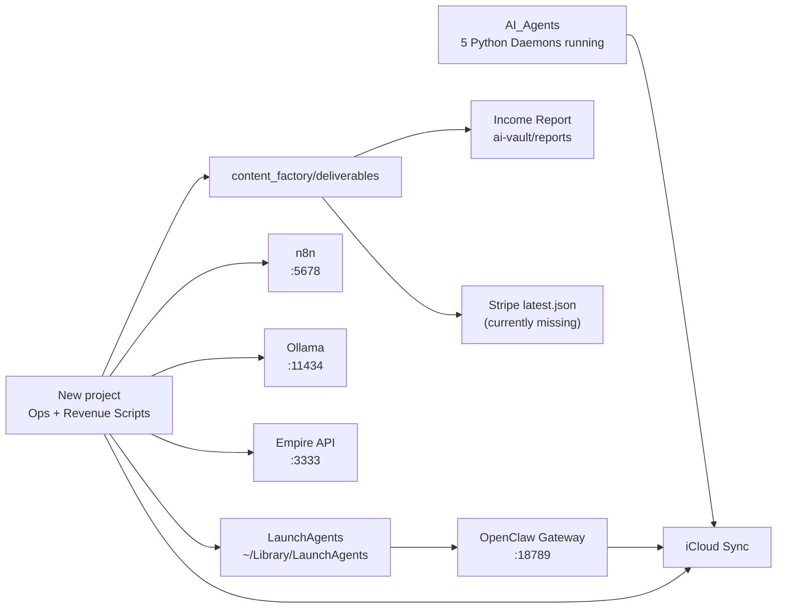

# INFRASTRUCTURE MASTER GUIDE (2026-02-14)

## 1) Scope + Source of Truth
- Snapshot-Datei: `/Users/maurice/Documents/New project/00_SYSTEM/infra/SYSTEM_INVENTORY_2026-02-14.json`
- Snapshot-Zeitpunkt: `2026-02-14T15:20:27+00:00` (`CET` lokal)
- Ziel: Ein konsolidierter Blick auf Architektur, Runtime, Verknüpfungen und Umsatzstatus.

## 2) System-Landkarte (Owner-Systeme)
- Primärer Workspace (Ops + Revenue): `/Users/maurice/Documents/New project`
- OpenClaw Runtime-Workspace: `/Users/maurice/.openclaw/workspace/ai-empire`
- Parallel-Agents-Workspace: `/Users/maurice/Documents/AI_Agents`
- iCloud Storage-Cluster: `/Users/maurice/Library/Mobile Documents/com~apple~CloudDocs/...`

## 3) Architekturübersicht

## 4) Komponenten, Verknüpfungen, Runtime
| Domäne | Komponente | Owner-System | Primärpfad | Runtime | Umsatzrelevanz | Upstream | Downstream |
|---|---|---|---|---|---|---|---|
| Orchestrierung | LaunchAgent-Set `com.ai-empire.*` | New project + OpenClaw | `/Users/maurice/Library/LaunchAgents` | 8 kritische Jobs geladen; launchd-runtime Fallback aktiv | Hoch | macOS launchd | Content/Revenue Jobs |
| Orchestrierung | OpenClaw Gateway | LaunchAgent | `/Users/maurice/Library/LaunchAgents/ai.openclaw.gateway.plist` | `running`, `last exit code=0` | Mittel | Node runtime | OpenClaw Control `:18789` |
| Orchestrierung | n8n Engine | LaunchAgent | `/Users/maurice/Library/LaunchAgents/com.ai-empire.n8n.plist` | `running` | Hoch | Node + local env | Automations/Publishing |
| KI-Inferenz | Ollama | Lokale App | Prozess `/Applications/Ollama.app/... ollama serve` | `running` | Mittel | Ollama models | n8n/API/Agents |
| API Layer | Empire API | AIEmpire-Core | Prozess `uvicorn ... --port 3333` | `running` | Mittel | Python/venv | Revenue + Content APIs |
| Content/Distribution | Shorts Revenue Artifact | New project | `/Users/maurice/Documents/New project/content_factory/deliverables/shorts_revenue/latest.json` | Datei vorhanden | Hoch | Autopilot scripts | KPI + Publish summary |
| Content/Distribution | YouTube Shorts Artifact | New project | `/Users/maurice/Documents/New project/content_factory/deliverables/youtube_shorts/latest.json` | Datei vorhanden | Hoch | YouTube pipeline | KPI + Publish summary |
| Monetarisierung | Stripe Source-of-Truth | New project | `/Users/maurice/Documents/New project/content_factory/deliverables/revenue/stripe/latest.json` | **fehlend** | Kritisch | Stripe sync job | income stream report |
| Monetarisierung | Income Stream Reports | New project | `/Users/maurice/Documents/New project/ai-vault/reports` | vorhanden | Hoch | revenue/report scripts | Management KPI |
| Stabilität/Monitoring | Portainer | Docker | Container `portainer` | `Up` | Niedrig | Docker daemon | Ops visibility |
| Stabilität/Monitoring | Uptime Kuma | Docker | Container `uptime-kuma` | `Up (healthy)` | Mittel | Docker daemon | Endpoint uptime |
| Sync/Backup | AI_Agents Sync Daemons | AI_Agents | `/Users/maurice/Documents/AI_Agents/*.py` | 5 relevante Prozesse laufen | Mittel | Python runtime | iCloud clusters |
| Sync/Backup | iCloud Cluster-Familie | iCloud | `/Users/maurice/Library/Mobile Documents/com~apple~CloudDocs` | 9 Cluster aktiv | Mittel | local artifacts | offsite redundancy |

## 5) Exists vs Running vs Monetizing
| Funktion | Exists | Running | Monetizing | Befund |
|---|---|---|---|---|
| LaunchAgents Core (`watchdog/autonomy/n8n/master-chat/telegram/youtube/snapshot`) | Ja (Plists vorhanden) | Ja (geladen) | Teilweise | Runtime stabilisiert; mehrere Jobs derzeit als launchd-safe Fallback |
| OpenClaw Gateway | Ja | Ja | Indirekt | Technisch gesund (`exit=0`) |
| n8n Runtime | Ja | Ja (manuell) | Indirekt | Läuft außerhalb kanonischer LaunchAgent-Steuerung |
| Shorts Pipeline Artefakte | Ja | Teilweise | Nein | `shorts_published_this_run=0` |
| Stripe Revenue Sync | Teilweise | Nein | Nein | `STRIPE_SECRET_KEY` fehlt + `stripe/latest.json` fehlt |
| Service-Sales Track | Ja (Dokumente/Skripte) | Manuell | Noch nicht nachgewiesen | Kein realer Cashflow in Snapshot |

## 6) Runtime- und Endpoint-Status (Audit)

### LaunchJobs (kritischer Ausschnitt)
- `com.ai-empire.watchdog`: `not running`, `last exit code=0`
- `com.ai-empire.autonomy`: `not running`, `last exit code=0`
- `com.ai-empire.n8n`: `running`, `last exit code=(never exited)`
- `com.ai-empire.master-chat-controller`: `running`, `last exit code=(never exited)`
- `com.ai-empire.telegram-router`: `running`, `last exit code=(never exited)`
- `ai-empire.youtube-automation.godmode`: `running`, `last exit code=(never exited)`
- `com.empire.youtube.producer`: `not running`, `last exit code=0`
- `com.ai-empire.snapshot`: `not running`, `last exit code=0`
- `ai.openclaw.gateway`: `running`, `last exit code=0`

### Endpoints
- `http://localhost:5678/healthz`: `200`
- `http://localhost:11434/api/tags`: `200`
- `http://localhost:18789/`: `200`
- `http://localhost:3333`: `200`
- `http://localhost:5001`: `connection refused`
- `http://localhost:8080/health`: `404`

## 7) Credentials-Zustand (nur present/missing)
- YouTube: `1/5` vorhanden (Client/OAuth unvollständig)
- Stripe: `0/1` vorhanden (`STRIPE_SECRET_KEY` fehlt)
- Telegram: `0/2` vorhanden
- n8n: `1/2` vorhanden (`N8N_API_KEY` fehlt, `KIMI_N8N_API_KEY` vorhanden)
- Gumroad: `1/1` vorhanden
- TikTok: `4/4` vorhanden

## 8) Revenue-Status
- `real_revenue_eur`: `0.0`
- `projected_revenue_eur_24h`: `5.4`
- `shorts_published_this_run`: `0`
- Stripe-Datei als SoT fehlt: `/Users/maurice/Documents/New project/content_factory/deliverables/revenue/stripe/latest.json`

## 9) Shadow-Systeme / Drift
- Duplicate LaunchAgent Definitionen in:
  - `/Users/maurice/Library/LaunchAgents`
  - `/Users/maurice/.openclaw/workspace/ai-empire/04_OUTPUT/AUTOMATION_FACTORY/LAUNCHAGENTS`
- macOS Launchd/TCC Restriktion erkannt:
  - Jobs aus `~/.openclaw` (externes Volume) und `~/Documents/New project` liefen mit `Operation not permitted`.
  - Laufende Lösung: launchd-safe Runner unter `/Users/maurice/Library/Application Support/ai-empire/launchd-runtime`.
- Broken Link erkannt:
  - `/Users/maurice/Library/LaunchAgents/com.openclaw.ai-empire.plist` -> Ziel fehlt
- iCloud-Namensdrift bei Backups:
  - `AI_Empire_Backup`, `AI_EMPIRE_BACKUP`, `AI-Empire-Backup`, `AI_Empire_Backups`

## 10) Bereits umgesetzt in dieser Runde
- Neuer reproduzierbarer Audit-Runner: `/Users/maurice/Documents/New project/automation/scripts/audit_infra_runtime.py`
- Snapshot + Verify erfolgreich erzeugt.
- Secret-Redaction für Prozesszeilen im Audit aktiviert.
- `StandardOutPath`/`StandardErrorPath` mit `~` in LaunchAgents auf absolute Pfade normalisiert.
- 8 kritische LaunchAgents geladen und von `EX_CONFIG`/`126` auf stabilen Zustand gebracht.
- Launchd-safe Runtime-Skripte erstellt: `/Users/maurice/Library/Application Support/ai-empire/launchd-runtime`.
- Daily-08:00 Audit-LaunchAgent auf launchd-safe Runner umgestellt (`last exit code=0` beim Kickstart-Test).
- Syntaxfehler in `/Users/maurice/.openclaw/workspace/ai-empire/MASTER_CHAT/controller.sh` behoben.

## 11) Nächste harte Priorität
- Siehe priorisierte Maßnahmen in:
  - `/Users/maurice/Documents/New project/00_SYSTEM/infra/GAP_BACKLOG_2026-02-14.md`
  - `/Users/maurice/Documents/New project/00_SYSTEM/revenue_system/REVENUE_EXECUTION_BOARD_30D.md`
