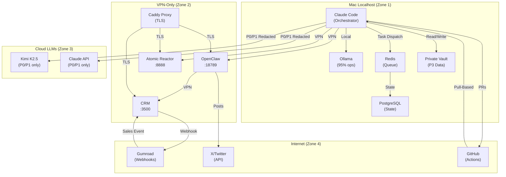
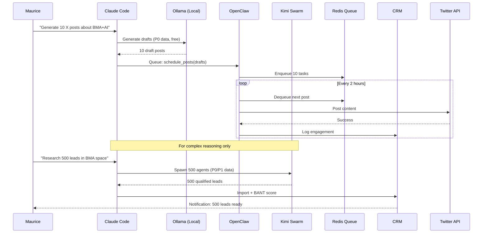

# AI Empire Architecture — Secure Autonomous System

**Version:** 1.0
**Last Updated:** 2026-02-10
**Status:** Production

---

## System Overview

AIEmpire-Core is a **VPN-first, privacy-hardened, autonomous agent ecosystem** that runs 24/7 with <1% manual intervention. The system orchestrates 100K-500K Kimi agents via Claude, uses Ollama for 95% of operations (cost optimization), and maintains strict privacy boundaries (P0-P3 levels).

**Core Principles:**
- **Offline-First:** 95% operations run on local Ollama models
- **Privacy-by-Design:** P3 data never leaves Mac, P2 restricted to secure channels
- **Pull-Based Cloud:** Cloud agents propose (via PRs), Mac approves (merge gate)
- **Zero Public Exposure:** All services behind Tailscale VPN
- **Autonomous with Guardrails:** Agents can act within sandboxed scopes; high-risk actions require manual approval

---

## Components

### 1. Control Layer
**Claude Code + GitHub**
- Primary orchestrator and decision engine
- Handles high-stakes decisions, strategy, and architecture
- Cost: ~1% of total LLM spend
- Access: VPN-only, owner-authenticated

### 2. Agent Layer
**OpenClaw (Port 18789)**
- 9 cron jobs for scheduling, monitoring, task dispatch
- Agent roles:
  - **Research Agent:** Market intel, competitor analysis, trend spotting
  - **Content Agent:** X/Twitter posts, blog articles, email campaigns
  - **Dev Agent:** Code generation, refactoring, test writing
  - **Ops Agent:** Deployment, monitoring, incident response
  - **QA Agent:** Test execution, bug triage, regression checks
  - **Security Agent:** Vulnerability scanning, secret scanning, access audits
  - **Growth Agent:** Lead gen, CRM updates, conversion optimization
- Tech: Python FastAPI, Redis for task queue, PostgreSQL for state
- Access: Localhost + VPN only

**Kimi Swarm (50K-500K agents)**
- Scales to 500K concurrent agents for parallel execution (research, content, lead gen)
- Orchestrated by Claude via `kimi-swarm/` workflows
- Cost: ~4% of total LLM spend (Kimi K2.5 cheaper than Claude)
- Privacy: Only P0 (public) and P1 (low-sensitivity) data sent to cloud

### 3. Model Layer
**Ollama (Local, Free)**
- 3 models: deepseek-r1:8b, qwen2.5-coder:7b, glm-4.7-flash
- Handles 95% of operations: content drafts, code generation, data processing
- Zero cost, zero latency to cloud, full privacy
- Port: 11434 (localhost only)

**Kimi K2.5 (Cloud, Budget $12)**
- Complex reasoning, long-context tasks (50K-500K agents)
- Only for P0/P1 data
- API: api.moonshot.ai/v1

**Claude 4.5/4.6 (Cloud, Minimal)**
- High-stakes decisions, architecture, security reviews
- Only for P0/P1 data
- Cost: ~1% of LLM spend

### 4. Data Layer
**Redis (Port 6379)**
- Task queue for atomic-reactor and OpenClaw
- Session state for workflows
- Pub/sub for agent coordination

**PostgreSQL (Port 5432)**
- Agent state, task history, audit logs
- CRM data (leads, contacts, pipeline)
- System metrics and KPIs

**ChromaDB**
- Vector store for semantic search
- Gold Nugget embeddings
- Research document retrieval

**File System (Privacy-Aware)**
- `~/.private-vault/` — P3 data, never exported, never to cloud
- `~/.openclaw/workspace/ai-empire/` — P0-P2 data, exportable with redaction
- `/Users/maurice/AIEmpire-Core/` — Repo, P0 (public) only

### 5. Task Execution
**Atomic Reactor (FastAPI, Port 8888)**
- YAML-based task definitions
- Async runner with idempotency
- Retry/backoff, rate limits, dead-letter queue

**Workflow System (Opus 4.6 5-Step Loop)**
- AUDIT → ARCHITECT → ANALYST → REFINERY → COMPOUNDER
- Weekly cycle, full system review and optimization
- CLI: `python workflow-system/orchestrator.py`

**Cowork Engine (Autonomous Daemon)**
- Observe → Plan → Act → Reflect every 30 minutes
- Focuses: revenue, content, automation, product
- CLI: `python workflow-system/cowork.py --daemon`

**Resource Guard**
- Monitors CPU/RAM/Disk
- Auto-throttles at 70% CPU, emergency stop at 95%
- Prevents system overload from runaway agents

### 6. Revenue Systems
**X/Twitter Lead Machine**
- Content generation: viral replies, threads, posts
- Lead scoring: BANT (Budget, Authority, Need, Timeline)
- CRM integration

**CRM (Express.js, Port 3500)**
- Lead tracking, pipeline management
- BANT scoring (0-100)
- Gumroad webhook integration

**Gumroad Integration**
- 3 products: AI Prompt Vault (EUR 27), Docker Guide (EUR 99), Stack-as-Service (EUR 99-999)
- Automated fulfillment, email sequences
- Webhook → CRM → follow-up automation

### 7. Interfaces
**CLI (Empire Control Center)**
- `python workflow-system/empire.py status` — System health
- `python workflow-system/empire.py workflow` — Run 5-step loop
- `python workflow-system/empire.py cowork --daemon` — Background agent
- `python workflow-system/empire.py mirror` — Export/sync with Mirror Lab

**WebUI (OpenClaw Dashboard, Port 18789)**
- Agent status, task queue, logs
- Metrics: uptime, task success rate, cost breakdown
- Access: VPN + password-protected

**Telegram Bot (Optional)**
- Status updates, alerts
- Manual approvals for high-risk actions
- Currently: token invalid, needs reconfig

### 8. Observability
**Logging**
- Centralized logs in `~/.openclaw/logs/`
- Structured JSON format
- Retention: 90 days

**Metrics**
- Prometheus scraping (future)
- Current: PostgreSQL-based KPI tracking
- Dashboards: Budget, revenue, uptime, agent performance

**Alerts**
- CPU/RAM/Disk thresholds (Resource Guard)
- Service health checks (Redis, PostgreSQL, Ollama)
- Security events (failed auth, suspicious commands)
- Delivery: Telegram (when reconfigured) + email

---

## Threat Boundaries & Trust Zones

### Zone 1: Mac Localhost (Trusted)
- Claude Code
- Ollama (95% of operations)
- Redis, PostgreSQL, ChromaDB
- Private Vault (~/.private-vault/)
- **Trust Level:** Full. P0-P3 data allowed.

### Zone 2: VPN-Only Services (Trusted)
- OpenClaw Dashboard (18789)
- Atomic Reactor API (8888)
- CRM (3500)
- Reverse Proxy (Caddy)
- **Trust Level:** High. P0-P2 data allowed. Access via Tailscale only.

### Zone 3: Cloud LLMs (Conditional Trust)
- Kimi K2.5 (api.moonshot.ai)
- Claude API (api.anthropic.com)
- **Trust Level:** Medium. P0-P1 data only. Redact secrets, emails, legal docs.

### Zone 4: Internet (Untrusted)
- Gumroad webhooks
- X/Twitter API
- GitHub Actions
- **Trust Level:** Zero. P0 (public) data only. All inputs sanitized, rate-limited, logged.

---

## Data Flow Diagram



---

## System Flow Diagram



---

## Security Architecture

### Network Perimeter
- **Default:** All services bound to localhost (127.0.0.1)
- **VPN Access:** Tailscale mesh network for remote access
- **Firewall:** macOS firewall enabled, deny-all inbound except VPN
- **No Public DNS:** Zero services resolve to public IPs

### Authentication & Authorization
- **Claude Code:** OAuth via Anthropic (owner-only)
- **OpenClaw Dashboard:** Password-protected (VPN + credentials)
- **Atomic Reactor API:** API key in macOS Keychain
- **CRM:** Session-based auth (VPN + password)
- **Postgres/Redis:** Localhost-only, no remote access

### Secrets Management
- **macOS Keychain:** API keys, passwords, tokens
- **sops + age:** Encrypted config files (future)
- **Never in Repo:** .env files gitignored, secrets rotated quarterly
- **Redaction:** Automatic removal of secrets from logs/exports

### Container Hardening (Future Docker/Podman)
- Run as non-root (UID 1000)
- Read-only root filesystem where possible
- Drop all Linux capabilities except required
- `no-new-privileges` flag
- Minimal base images (Alpine, distroless)

### Supply Chain Security
- Pinned dependency versions (requirements.txt, package-lock.json)
- Dependabot for automated updates
- GitHub Actions: minimal permissions (read-only by default)
- No npm `postinstall` scripts from untrusted sources

---

## Autonomy Guardrails

### Tool Sandboxing
**Allowed Commands:**
- Read files (glob, grep, cat)
- Write to approved directories (`~/.openclaw/workspace/`, `/tmp/`)
- Git operations (status, diff, log, commit, push to PRs only)
- LLM API calls (rate-limited)
- HTTP requests to allowlisted domains

**Forbidden Commands:**
- `rm -rf` without dry-run
- `sudo` / `su`
- Network scanning (nmap, masscan)
- SSH to external hosts
- Modifying system files (`/etc/`, `/usr/`, `/System/`)

### Dry-Run Default
- All destructive operations (`rm`, `DROP TABLE`, `git reset --hard`) require `--dry-run` first
- Agent must show plan, wait for approval, then execute
- Approval timeout: 5 minutes (auto-deny after)

### Rate Limits
- **Ollama:** Unlimited (local)
- **Kimi:** 100 requests/minute, 10K requests/day
- **Claude:** 50 requests/hour, 500 requests/day
- **X/Twitter:** 300 posts/day, 10 posts/hour
- **GitHub:** 100 commits/day, 10 PRs/day

### Idempotency
- All tasks must be idempotent (safe to retry)
- State tracked in PostgreSQL (task_id, status, retry_count)
- Max retries: 3, exponential backoff (2^n seconds)

### Manual Gate for High-Risk Actions
**Require Approval:**
- Deleting files >100MB or >1000 files
- Modifying `.github/workflows/`, `ops/`, `docs/SECURITY.md`
- Expanding permissions (GitHub Actions, API keys)
- Public exposure (opening ports, adding DNS records)
- Spending >EUR 10 (API credits, infrastructure)

**Approval Flow:**
1. Agent proposes action with risk score (1-10) and rollback plan
2. Telegram notification to Maurice (or dashboard alert)
3. Owner approves/denies within 30 minutes
4. Auto-deny if no response (fail-safe)

---

## Deployment Architecture

### Local Development (Current)
```
MacBook Pro
├── Ollama (11434)
├── Redis (6379)
├── PostgreSQL (5432)
├── OpenClaw (18789)
├── Atomic Reactor (8888)
├── CRM (3500)
└── Caddy Proxy (443) → VPN-only
```

### Production Hardening (Future)
```
MacBook Pro
├── Tailscale VPN (100.x.x.x)
├── Caddy Reverse Proxy
│   ├── openclaw.tail1234.ts.net → 18789
│   ├── reactor.tail1234.ts.net → 8888
│   └── crm.tail1234.ts.net → 3500
├── Docker Compose (or Podman)
│   ├── Ollama (read-only FS, non-root)
│   ├── Redis (persistent volume, backup hourly)
│   ├── PostgreSQL (persistent volume, backup hourly)
│   └── OpenClaw (read-only code, writable logs only)
└── Backups → Encrypted, versioned, tested monthly
```

---

## Scalability & Performance

### Current Capacity
- **Ollama:** 10 requests/second (local, depends on model size)
- **Redis:** 100K ops/second (localhost, single-threaded)
- **PostgreSQL:** 1K queries/second (localhost, single connection)
- **OpenClaw:** 50 concurrent tasks (Python asyncio)
- **Kimi Swarm:** 500K concurrent agents (cloud, API-limited)

### Bottlenecks
1. **Ollama inference speed:** 1-5 seconds per request (model-dependent)
2. **Mac RAM:** 16-32GB (limits Ollama concurrent models)
3. **Kimi API rate limits:** 100 req/min, 10K req/day
4. **Single Mac:** No horizontal scaling (future: multi-node Tailscale mesh)

### Optimization Strategies
- **Batch requests:** Group similar tasks for Ollama/Kimi
- **Cache aggressively:** Redis for repeated queries
- **Async everywhere:** Python asyncio, PostgreSQL connection pooling
- **Model routing:** Use smaller/faster models when accuracy isn't critical

---

## Backup & Disaster Recovery

### 3-2-1 Strategy
- **3 Copies:** Original + 2 backups
- **2 Media Types:** Local disk + cloud (encrypted)
- **1 Offsite:** Encrypted backup to cloud (P0/P1 only, P3 excluded)

### Backup Scope
- PostgreSQL (full DB dump, hourly)
- Redis (RDB snapshot, hourly)
- ChromaDB (vector index, daily)
- Code repos (GitHub, real-time)
- Private Vault (encrypted, daily, local-only)

### Restore Testing
- Monthly restore drill (verify backups not corrupted)
- Target: <30 minutes to restore full system
- Documented in `ops/runbooks/disaster-recovery.md`

---

## Monitoring & Alerts

### Health Checks
- **Service Uptime:** Ping Redis, PostgreSQL, Ollama, OpenClaw every 60s
- **Task Queue Depth:** Alert if Redis queue >1000 tasks
- **Disk Space:** Alert if <10GB free
- **CPU/RAM:** Alert if >85% sustained for 5 minutes

### Security Monitoring
- **Failed Auth Attempts:** >5 in 5 minutes
- **Suspicious Commands:** `sudo`, `rm -rf`, network scans
- **Outbound Traffic Anomalies:** Unexpected cloud API calls
- **Secret Leaks:** Scan logs for API keys, tokens, passwords

### Alert Delivery
- **Critical:** Telegram notification (when reconfigured) + SMS
- **Warning:** Dashboard alert + email
- **Info:** Log only

---

## Technology Stack Summary

| Layer | Technology | Port | Access |
|-------|-----------|------|--------|
| Orchestrator | Claude Code | — | Local |
| Local LLM | Ollama | 11434 | Localhost |
| Cloud LLM | Kimi K2.5, Claude API | — | HTTPS |
| Queue | Redis | 6379 | Localhost |
| Database | PostgreSQL | 5432 | Localhost |
| Vector Store | ChromaDB | — | Localhost |
| Agent Platform | OpenClaw (Python FastAPI) | 18789 | VPN |
| Task Runner | Atomic Reactor (FastAPI) | 8888 | VPN |
| CRM | Express.js | 3500 | VPN |
| Reverse Proxy | Caddy | 443 | VPN |
| VPN | Tailscale | — | Mesh |
| Monitoring | Custom (PostgreSQL + Resource Guard) | — | VPN |

---

## Evolution Roadmap

### Phase 1: Stabilization (Q1 2026) ✓
- [x] Core services running (Ollama, Redis, PostgreSQL, OpenClaw)
- [x] Workflow system operational
- [x] Mirror system built
- [ ] VPN hardening (Tailscale setup)
- [ ] Backup automation + restore testing

### Phase 2: Revenue Activation (Q2 2026)
- [ ] Gumroad products live
- [ ] Fiverr gigs published
- [ ] X/Twitter automation live
- [ ] CRM → Gumroad integration complete
- [ ] First EUR 10K/month

### Phase 3: Autonomous Operations (Q3 2026)
- [ ] 95% automation (content, lead gen, support)
- [ ] Kimi 50K agent swarm live
- [ ] Auto-triage + auto-merge for low-risk PRs
- [ ] 99.5% uptime, zero security incidents

### Phase 4: Scale (Q4 2026)
- [ ] EUR 100K/month AMRR
- [ ] OpenClaw Skills Marketplace live
- [ ] Multi-Mac Tailscale mesh (horizontal scaling)
- [ ] 500K Kimi agent capacity

---

## Contact & Escalation

**Owner:** Maurice Pfeifer
**Escalation Path:**
1. Dashboard alert → Auto-resolve if possible
2. If unresolved in 5 minutes → Telegram notification
3. If critical (data loss, security breach) → SMS + email

**On-Call:** Maurice (24/7, but agents handle 99%)

---

**Last Updated:** 2026-02-10
**Review Cadence:** Monthly or on major incident
**Status:** Production-ready with hardening in progress
