# AI EMPIRE ARCHITECTURE

**Last Updated**: 2026-02-10
**Owner**: Maurice Pfeifer (CEO) + CLAUDE (Chief Architect)
**Status**: V1 FINAL (Reference Implementation)

---

## 🏗️ SYSTEM OVERVIEW

```mermaid
graph TB
    subgraph "EXTERNAL INTERFACES"
        CLI["CLI / GitHub Actions"]
        MOBILE["Mobile Command Center"]
        TELEGRAM["Telegram Bot API"]
        WEBHOOKS["Webhooks (n8n, GitHub)"]
    end

    subgraph "CONTROL PLANE"
        ORCHESTRATOR["<b>ORCHESTRATOR</b><br/>Central Task Router<br/>(brain_system/orchestrator.py)"]
        MISSION["Mission Control Dashboard<br/>(GitHub Issues + Artifacts)"]
    end

    subgraph "LLM ROUTING LAYER"
        ROUTER["Model Router<br/>(Smart API gateway)"]
        OLLAMA["🔵 OLLAMA<br/>(Local: Free)<br/>qwen2.5-coder<br/>mistral, deepseek-r1<br/>Port: 11434"]
        KIMI["🟨 KIMI K2.5<br/>(Moonshot API)<br/>100-500K agents<br/>Budget ctrl"]
        CLAUDE["🔴 CLAUDE<br/>(Anthropic API)<br/>Strategy, code<br/>Critical decisions"]
    end

    subgraph "AGENT SWARM LAYER"
        BRAIN["Brain System<br/>(7 autonomous agents)<br/>Neocortex, CEO, Mouth, Numbers<br/>Drive, Hands, Memory"]
        KIMI_SWARM["Kimi Swarm<br/>(100K-500K agents)<br/>Parallel research<br/>Content generation<br/>Lead hunting"]
        X_MACHINE["X Lead Machine<br/>(Twitter automation)<br/>Viral content<br/>Lead generation<br/>Community building"]
    end

    subgraph "DATA LAYER - DATABASES"
        POSTGRES["🐘 PostgreSQL 15<br/>(Port 5432)<br/>—<br/>Users, conversations<br/>Models, messages<br/>n8n state<br/>Redis: ✅<br/>Replication: ❌"]
        REDIS["🔴 Redis 7<br/>(Port 6379)<br/>—<br/>Session cache<br/>Real-time state<br/>Rate limit counters"]
        CHROMADB["🟣 ChromaDB<br/>(Port 8000)<br/>—<br/>Vector embeddings<br/>Semantic search<br/>Knowledge base<br/>Persistence: duckdb"]
        SQLITE["📦 SQLite<br/>(CRM local)<br/>—<br/>Leads + BANT<br/>Scoring<br/>Light analytics"]
    end

    subgraph "ORCHESTRATION & WORKFLOW"
        ATOMIC["Atomic Reactor<br/>(YAML-based)<br/>Task definitions<br/>5 pre-built tasks<br/>Extensible"]
        N8N["n8n Automation<br/>(Port 5678)<br/>—<br/>8 workflows<br/>Webhooks<br/>Continuous ops"]
    end

    subgraph "BUSINESS LOGIC"
        CONTENT["Content Engine<br/>(Blog, X, Email)<br/>Auto-generation<br/>Scheduling<br/>Distribution"]
        SALES["Sales Engine<br/>(Leads, outreach)<br/>CRM API<br/>BANT scoring<br/>Email sequences"]
        BMA["BMA System<br/>(Fire alarms)<br/>Checklists<br/>Knowledge base<br/>Consulting mgmt"]
    end

    subgraph "API LAYER"
        EMPIRE_API["Empire API<br/>(FastAPI Port 3333)<br/>—<br/>Health checks<br/>REST endpoints<br/>WebSocket<br/>JWT auth<br/>CORS whitelist"]
        CRM_API["CRM API<br/>(Express Port 3500)<br/>—<br/>BANT scoring<br/>Lead mgmt<br/>REST"]
    end

    subgraph "SECURITY & OBSERVABILITY"
        VAULT["Secrets Vault<br/>(⭐ TODO)<br/>—<br/>Key rotation<br/>Access audit<br/>Encryption at rest"]
        MONITORING["Monitoring Stack<br/>(⭐ TODO)<br/>—<br/>Prometheus<br/>Grafana<br/>Loki logs<br/>Alerting"]
        GATES["Security Gates<br/>(⭐ TODO)<br/>—<br/>Pre-commit checks<br/>Code scanning<br/>Dependency audit"]
    end

    subgraph "DEPLOYMENT & OPS"
        DOCKER["Docker Compose<br/>(Local)<br/>—<br/>All services<br/>Health checks<br/>Resource limits"]
        GITHUB_CI["GitHub Actions<br/>(11 workflows)<br/>—<br/>Daily content<br/>Health checks<br/>Revenue tracking"]
        BACKUP["Backup System<br/>(⭐ TODO)<br/>—<br/>3-2-1 strategy<br/>Point-in-time<br/>Restore tests"]
    end

    subgraph "EXTERNAL SERVICES"
        GUMROAD["💰 Gumroad<br/>(Revenue)<br/>Digital products<br/>Payment processor"]
        FIVERR["💰 Fiverr<br/>(Revenue)<br/>Services<br/>Lead gen"]
        TWITTER["X/Twitter<br/>(Content)<br/>Viral reach<br/>Lead gen"]
        EMAIL["Email Service<br/>(SendGrid?)<br/>Nurture<br/>Outreach"]
    end

    %% CONNECTIONS
    CLI --> ORCHESTRATOR
    MOBILE --> ORCHESTRATOR
    TELEGRAM --> ORCHESTRATOR
    WEBHOOKS --> N8N

    ORCHESTRATOR --> ROUTER
    MISSION --> ORCHESTRATOR

    ROUTER --> OLLAMA
    ROUTER --> KIMI
    ROUTER --> CLAUDE

    ORCHESTRATOR --> BRAIN
    ORCHESTRATOR --> KIMI_SWARM
    ORCHESTRATOR --> X_MACHINE

    BRAIN --> ROUTER
    KIMI_SWARM --> ROUTER
    X_MACHINE --> ROUTER

    EMPIRE_API --> POSTGRES
    EMPIRE_API --> REDIS
    EMPIRE_API --> CHROMADB
    CRM_API --> SQLITE

    ORCHESTRATOR --> EMPIRE_API
    ORCHESTRATOR --> ATOMIC
    ATOMIC --> N8N
    N8N --> EMPIRE_API

    BRAIN --> CONTENT
    BRAIN --> SALES
    BRAIN --> BMA

    CONTENT --> TWITTER
    CONTENT --> EMAIL
    SALES --> GUMROAD
    SALES --> FIVERR
    SALES --> EMAIL

    EMPIRE_API --> VAULT
    EMPIRE_API --> MONITORING
    GITHUB_CI --> GATES

    DOCKER --> POSTGRES
    DOCKER --> REDIS
    DOCKER --> CHROMADB
    DOCKER --> EMPIRE_API
    DOCKER --> N8N

    GITHUB_CI --> DOCKER

    BACKUP --> POSTGRES
    BACKUP --> REDIS
    BACKUP --> CHROMADB

    style ORCHESTRATOR fill:#ff9999
    style ROUTER fill:#ffcc99
    style POSTGRES fill:#99ccff
    style REDIS fill:#ff6666
    style CHROMADB fill:#cc99ff
    style EMPIRE_API fill:#99ff99
    style VAULT fill:#ffcccc
    style MONITORING fill:#ffcccc
    style GATES fill:#ffcccc
    style BACKUP fill:#ffcccc
```



---

## 📦 MODULE BREAKDOWN

### **1. ORCHESTRATOR (Brain_System)**
**Purpose**: Central decision & task routing engine

**Components**:
- `orchestrator.py` → Routes tasks to agents based on priority/cost
- `7 brain agents` → Specialized LLM personas (Neocortex, CEO, Mouth, Numbers, Drive, Hands, Memory)
- `model_router.py` → Smart API selection (Ollama → Kimi → Claude)

**Inputs**: CLI, Webhooks, GitHub issues, scheduled tasks
**Outputs**: Tasks, decisions, agent instructions

**2026 Status**: ✅ Ready (needs integration testing)

---

### **2. LLM ROUTING LAYER**
**Purpose**: Smart API gateway with cost control & model selection

**Current Implementation** (needs formalization):
```
Decision Tree:
├─ Simple task (coding, editing)? → OLLAMA (free, instant)
├─ Complex research (<50K tokens)? → KIMI (cheap, fast)
├─ Strategic decision? → CLAUDE (expensive, best quality)
└─ Cost > daily budget? → QUEUE + RETRY tomorrow
```

**Required Hardening**:
- [ ] Formal cost tracking per LLM call
- [ ] Hard budget caps (daily/monthly)
- [ ] Queue system for budget overruns
- [ ] Cost alerts (P1 if >EUR 50/day)

---

### **3. AGENT SWARM**

#### **A) Brain System (7 Agents)**
| Agent | Aka | Role | Models | Output |
|-------|-----|------|--------|--------|
| Neocortex | Visionary | Long-term strategy, vision, planning | CLAUDE | Strategic ideas |
| Prefrontal Cortex | CEO | Decisions, prioritization, risk | CLAUDE+KIMI | Action commands |
| Temporal Cortex | Mouth | Communication, content, engagement | KIMI | Blog posts, emails, X content |
| Parietal Cortex | Numbers | Analytics, finance, metrics | OLLAMA+KIMI | Revenue reports, KPI tracking |
| Limbic System | Drive | Motivation, goal alignment, feedback | CLAUDE | Agent coaching, morale |
| Cerebellum | Hands | Automation, execution, tools, code | OLLAMA | Scripts, fixes, integrations |
| Hippocampus | Memory | Learning, pattern storage, context | CHROMADB | Gold nuggets, lessons, rules |

**2026 Status**: ✅ Architecture done, 40% implemented

---

#### **B) Kimi Swarm (100K-500K Agents)**
**Purpose**: Parallel research, content generation, lead hunting

**Structure**:
- 100K base agents (free tier)
- Expandable to 500K (paid tier)
- Async batch processing via GitHub API
- Cost tracking + auto-throttling

**2026 Status**: ⚠️ Framework ready, needs reliability testing

---

#### **C) X Lead Machine**
**Purpose**: Twitter/X automation, viral content, lead generation

**Flow**:
1. Content generation (brain_system)
2. Scheduling + timing optimization
3. Publishing + engagement automation
4. Lead extraction + nurturing

**2026 Status**: ⚠️ Partial (publishing works, engagement loop incomplete)

---

### **4. DATA LAYER - DATABASES**

| DB | Port | Purpose | Driver | Replicas | Backup |
|----|------|---------|--------|----------|--------|
| **PostgreSQL 15** | 5432 | Users, messages, state, n8n | psycopg2+SQLAlchemy | ❌ None yet | ⭐ TODO |
| **Redis 7** | 6379 | Session cache, rate limits | redis-py | ❌ Sentinel | ⭐ TODO |
| **ChromaDB** | 8000 | Vector embeddings, semantic search | chroma-py | ❌ None | Parquet files |
| **SQLite** | (local) | CRM leads, scoring | sqlite3 | N/A | ⭐ TODO |

**Data Schema** (simplified):
```sql
-- Users & auth
users: id, username, password_hash, api_key, created_at

-- Conversations (context for agents)
conversations: id, user_id, topic, created_at, expires_at

-- Messages (audit trail)
messages: id, conversation_id, role, content, model, cost_usd, timestamp

-- Models (available LLMs)
models: id, name, model_id, provider, cost_per_1k_tokens, max_tokens

-- n8n state
n8n_workflows: id, name, state, last_run, next_run
n8n_executions: id, workflow_id, status, started_at, ended_at

-- CRM (Leads)
leads: id, name, email, bant_score, source, created_at, status

-- Vectors (ChromaDB)
embeddings: id, content, vector, metadata, created_at
```

**2026 Status**: ✅ Schema ready, ⚠️ Backup incomplete, ❌ Replication missing

---

### **5. ORCHESTRATION & WORKFLOW**

#### **A) Atomic Reactor (Task Runner)**
**Purpose**: YAML-based task definitions + Docker orchestration

**Pre-built Tasks**:
1. `lead_research.yaml` → Find 100 qualified leads
2. `content_generation.yaml` → Generate blog post + social posts
3. `competitor_analysis.yaml` → Analyze competitors
4. `product_ideas.yaml` → Brainstorm products
5. `bma_services.yaml` → Generate BMA consulting ideas

**Extensibility**: Add new tasks by writing YAML + registry entry

**2026 Status**: ⚠️ Framework working, needs safety gates + cost tracking

---

#### **B) n8n Automation**
**Purpose**: Scheduled workflows + webhooks

**8 Core Workflows** (planned for MVP):
1. Daily content generation (6 AM UTC)
2. Lead research (10 AM UTC)
3. Email sequences (4 PM UTC)
4. Social posting (every 6h)
5. Revenue tracking (daily)
6. System health check (every 1h)
7. Backup job (nightly)
8. Weekly review (Sunday, 10 AM UTC)

**Execution**: n8n REST API via Python orchestrator

**2026 Status**: ⚠️ Service running, workflows not fully implemented

---

### **6. API LAYER**

#### **Empire API (FastAPI)**
**Port**: 3333
**Authentication**: JWT (24-hour expiration)
**CORS**: ⚠️ Currently "*" needs whitelist

**Endpoints**:
```
GET    /                       → Welcome + status
GET    /api/health             → Full system health
GET    /api/gold-nuggets       → Business intelligence
GET    /api/tasks              → Available atomic reactor tasks
GET    /api/brains             → Brain system status
POST   /api/action             → Execute action
WebSocket /ws                  → Real-time updates

(More to be documented in OpenAPI spec)
```

**2026 Status**: ✅ Basic framework, ⚠️ Needs OpenAPI docs + security hardening

---

#### **CRM API (Express.js)**
**Port**: 3500
**Database**: SQLite

**Endpoints**:
```
POST   /leads                  → Add lead
GET    /leads/:id              → Get lead with BANT score
PUT    /leads/:id              → Update lead status
GET    /leads/search?q=...     → Search leads
POST   /leads/:id/score        → Recalculate BANT
```

**2026 Status**: ✅ Basic framework, ⚠️ Needs integration with Orchestrator

---

### **7. BUSINESS LOGIC**

#### **Content Engine**
- **Input**: Brain-generated ideas + top-performing templates
- **Processing**: Auto-generate → Optimize → Schedule → Publish
- **Channels**: Blog, X/Twitter, LinkedIn, Email, Reddit, Discord
- **Output**: 10-50 pieces/day across channels
- **2026 Status**: ⚠️ Partial (X working, others planned)

---

#### **Sales Engine**
- **Input**: Lead research + conversation intelligence
- **Processing**: Score (BANT) → Segment → Personalize → Outreach
- **Channels**: Email, LinkedIn, Gumroad, Fiverr
- **Output**: Qualified leads → Conversions
- **2026 Status**: ❌ Not integrated yet

---

#### **BMA System**
- **Input**: Customer needs + audit findings
- **Processing**: Checklist generation + optimization suggestions
- **Output**: Audit reports, checklists, training videos
- **Revenue**: Consulting (EUR 2-5K/engagement)
- **2026 Status**: ⚠️ Knowledge base exists, automation incomplete

---

### **8. SECURITY & OBSERVABILITY** ⭐ **CRITICAL - BUILDING NOW**

#### **Secrets Vault** (⭐ TODO)
- **Purpose**: Centralized secret management
- **Implementation**: sops + age (Open Source) OR AWS Secrets Manager
- **Rotation**: Auto-rotate API keys every 90 days
- **Audit**: Log all secret access

---

#### **Monitoring Stack** (⭐ TODO)
**Components**:
- **Prometheus** (9090): Metrics collection
- **Grafana** (3000): Dashboards + alerting
- **Loki** (3100): Log aggregation
- **AlertManager**: Alert routing + deduplication

**Key Metrics**:
- API latency, error rate, throughput
- LLM costs by model (daily spend)
- Agent swarm health (active agents, queue size)
- Database health (connections, replication lag)
- System resources (CPU, RAM, disk, network)
- Business metrics (leads generated, revenue)

---

#### **Security Gates** (⭐ TODO)
**Pre-commit** → **Tests** → **Lint** → **Security Scan** → **SBOM** → **Manual Approval** → **Deploy**

---

### **9. DEPLOYMENT & OPS**

#### **Docker Compose** (Local)
**Services**:
- PostgreSQL 15 (port 5432)
- Redis 7 (port 6379)
- ChromaDB (port 8000)
- Ollama (port 11434)
- Empire API (port 3333)
- n8n (port 5678)
- CRM API (port 3500)
- **NEW**: Traefik reverse proxy (port 80/443)
- **NEW**: Prometheus (port 9090)
- **NEW**: Grafana (port 3000)

**Resource Limits** (already set, good):
- Ollama: 4 CPUs / 16GB (LLM inference heavy)
- PostgreSQL: 2 CPUs / 1GB
- Others: 1-2 CPUs / 512MB-2GB

**2026 Status**: ✅ Working, ⚠️ Reverse proxy + monitoring needed

---

#### **GitHub Actions** (11 Workflows)
**Status**: ✅ All active

**Key Workflows**:
1. `mission-control-scan.yml` → Daily strategy review
2. `daily-content-engine.yml` → 4x daily content
3. `auto-process-issues.yml` → Issue automation
4. `claude-health-check.yml` → System health
5. `gold-nugget-extractor.yml` → Intelligence extraction
6. `issue-command-bot.yml` → GitHub bot (@bot commands)
7. `revenue-tracking.yml` → Revenue metrics
8. `weekly-review.yml` → Strategic review

**2026 Status**: ✅ Core done, ⚠️ Need security gates + cost tracking

---

## 🔄 DATA FLOWS

### **Flow 1: Content Generation (Daily)**
```
Scheduled Trigger (6 AM UTC)
  ↓
Orchestrator calls Brain System (Content Agent)
  ↓
Brain System → KIMI (generate 10 content ideas)
  ↓
Content Engine → Optimize for each channel (X, LinkedIn, Blog)
  ↓
n8n Scheduler → Post at optimal times
  ↓
X/Twitter API, Email, Blog API → Publish
  ↓
Gold Nugget (Memory) → Store learnings (what worked?)
```

### **Flow 2: Lead Generation (Continuous)**
```
Scheduled OR Webhook Trigger
  ↓
Kimi Swarm (100K agents) → Research leads in parallel
  ↓
CRM API → Score leads (BANT)
  ↓
Sales Engine → Personalized outreach
  ↓
Email API (SendGrid?) + Gumroad → Contact leads
  ↓
Conversions → Database + Revenue tracking
  ↓
Gold Nugget → What segments convert best?
```

### **Flow 3: System Health & Auto-Remediation**
```
Every 5 minutes (Prometheus scrape)
  ↓
Healthcheck endpoints
  ↓
Metrics → Grafana + AlertManager
  ↓
Alert triggered? (e.g., CPU > 85%)
  ↓
Auto-response: Pause agents / Clear cache / Restart service
  ↓
If not resolved → PagerDuty OR Telegram to Maurice
```

---

## 🛡️ SECURITY HARDENING NEEDED (PHASE 2)

**CRITICAL**:
1. TLS/mTLS for all service-to-service communication
2. Secrets vault (sops/age)
3. Rate limiting + DDoS protection
4. API key rotation
5. Audit logging for all agent actions

**HIGH**:
6. Container security (rootless, seccomp, read-only FS)
7. Network policies (service-to-service isolation)
8. Dependency scanning (Dependabot)
9. SBOM generation
10. Incident response automation

**MEDIUM**:
11. Multi-region backups (3-2-1 strategy)
12. Disaster recovery testing
13. Compliance audit (GDPR, DIN, ISO)
14. Load testing + chaos experiments

---

## 📊 DEPLOYMENT ENVIRONMENTS

| Environment | Purpose | Docker | CI/CD | Monitoring | Backup |
|-------------|---------|--------|-------|------------|--------|
| **Local Dev** | Development | ✅ Compose | ✅ GitHub | ⚠️ Partial | ❌ Manual |
| **Staging** | Pre-production | 🔄 Planned | ✅ GitHub | 🔄 Planned | ❌ None |
| **Production (1.0)** | 24/7 revenue | ❌ N/A yet | ✅ GitHub | 🔄 Planned | 🔄 Planned |

---

## 📈 PERFORMANCE TARGETS

| Metric | Current | 90-Day | 12-Month |
|--------|---------|--------|----------|
| API latency (p99) | ? | <100ms | <50ms |
| Agent throughput | ? | 1K tasks/hour | 10K tasks/hour |
| System uptime | ? | 99.90% | 99.95% |
| LLM cost per task | EUR 0.10-1.00 | EUR 0.05-0.50 | EUR 0.02-0.20 |
| Content generation | 0 pieces/day | 10/day | 50/day |
| Leads generated | 0/month | 2,000/month | 10,000/month |

---

## 🚨 KNOWN ISSUES & BLOCKERS

| Issue | Severity | Status | Owner | ETA |
|-------|----------|--------|-------|-----|
| No Prometheus/Grafana monitoring | P1 | 🔄 Building | CLAUDE | 2026-02-28 |
| No secrets vault | P1 | 🔄 Building | CLAUDE | 2026-02-28 |
| No reverse proxy (TLS) | P1 | 🔄 Building | CLAUDE | 2026-02-17 |
| n8n not fully integrated | P2 | ⚠️ Partial | OLLAMA | 2026-02-21 |
| Sales engine incomplete | P2 | ❌ Not started | TBD | 2026-03-10 |
| PARL optimization pending | P3 | ⏳ Q2 | KIMI | 2026-04-01 |

---

## ✅ NEXT STEPS (Ordered by Priority)

1. **Traefik reverse proxy** (3 days, CLAUDE)
2. **Prometheus + Grafana** (5 days, CLAUDE)
3. **Secrets vault (sops/age)** (2 days, CLAUDE)
4. **Security gates (CI/CD)** (3 days, CLAUDE)
5. **Backup + disaster recovery** (4 days, OPS)
6. **n8n full integration** (3 days, OLLAMA)
7. **Gumroad revenue activation** (2 days, MAURICE)
8. **Fiverr gigs launch** (3 days, MAURICE)
9. **PARL optimization** (Depends on stable revenue)
10. **Multi-region deployment** (Q2 2026)

---

**END OF ARCHITECTURE.md**
