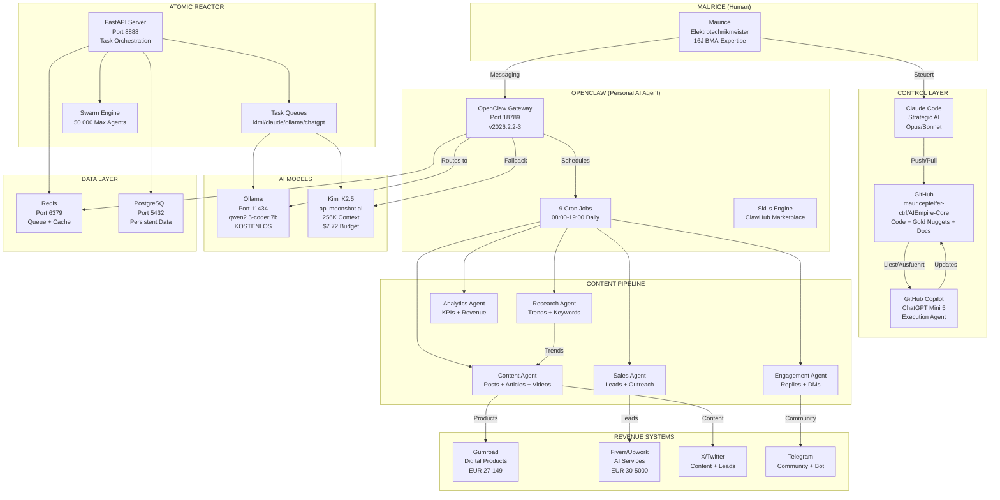

# SYSTEM ARCHITECTURE - Maurice's AI Empire
# Stand: 2026-02-08

## VISUAL ARCHITECTURE (Mermaid Diagram)



## COMPONENT STATUS MAP

```
╔══════════════════════════════════════════════════════════════╗
║                  MAURICE'S AI EMPIRE                        ║
║                  Status: 2026-02-08                         ║
╠══════════════════════════════════════════════════════════════╣
║                                                              ║
║  ┌─────────────────┐  ┌─────────────────┐                   ║
║  │ CLAUDE CODE     │  │ GITHUB          │                   ║
║  │ ✅ Active       │→→│ ✅ Connected    │                   ║
║  │ Opus/Sonnet     │  │ AIEmpire-Core   │                   ║
║  └────────┬────────┘  └────────┬────────┘                   ║
║           │                     │                            ║
║           ▼                     ▼                            ║
║  ┌─────────────────┐  ┌─────────────────┐                   ║
║  │ OPENCLAW        │  │ COPILOT/GPT     │                   ║
║  │ ✅ Running      │  │ ✅ Connected    │                   ║
║  │ Port 18789      │  │ ChatGPT Mini 5  │                   ║
║  │ 9 Cron Jobs     │  │ via GitHub      │                   ║
║  └────────┬────────┘  └─────────────────┘                   ║
║           │                                                  ║
║           ▼                                                  ║
║  ┌─────────────────┐  ┌─────────────────┐                   ║
║  │ OLLAMA          │  │ KIMI K2.5       │                   ║
║  │ ⏳ Loading      │  │ ✅ Active       │                   ║
║  │ Port 11434      │  │ $7.72 Budget    │                   ║
║  │ qwen2.5-coder   │  │ 256K Context    │                   ║
║  └────────┬────────┘  └────────┬────────┘                   ║
║           │                     │                            ║
║           ▼                     ▼                            ║
║  ┌─────────────────┐  ┌─────────────────┐                   ║
║  │ REDIS           │  │ POSTGRESQL      │                   ║
║  │ ⚠️ Restart      │  │ ⚠️ Restart     │                   ║
║  │ Port 6379       │  │ Port 5432       │                   ║
║  └─────────────────┘  └─────────────────┘                   ║
║                                                              ║
║  ┌──────────────────────────────────────────────────────┐   ║
║  │ ATOMIC REACTOR                                       │   ║
║  │ ⚠️ Not Running (Port 8888)                          │   ║
║  │ 5 Tasks defined, 50K max agents, Swarm ready        │   ║
║  └──────────────────────────────────────────────────────┘   ║
║                                                              ║
║  ┌──────────────────────────────────────────────────────┐   ║
║  │ REVENUE CHANNELS                                     │   ║
║  │ Gumroad: ✅ (1 product)  Fiverr: ❌ (0 gigs)       │   ║
║  │ X/Twitter: ⚠️ (posts ready)  Telegram: ❌ (no bot) │   ║
║  └──────────────────────────────────────────────────────┘   ║
║                                                              ║
║  REVENUE: EUR 0  │  TARGET: EUR 50-100 overnight            ║
╚══════════════════════════════════════════════════════════════╝
```

## DATA FLOW

```
INPUT                    PROCESSING              OUTPUT
─────                    ──────────              ──────
Trends (X/YT/TT)  ───→  Research Agent    ───→  Trend Report
                         │
Trend Report       ───→  Content Agent    ───→  Posts/Scripts/Articles
                         │
Content Posted     ───→  Engagement Agent ───→  Replies/DMs
                         │
Leads Generated    ───→  Sales Agent      ───→  Outreach/Follow-up
                         │
All Data           ───→  Analytics Agent  ───→  KPI Dashboard
                         │
Revenue Data       ───→  Finance Agent    ───→  Weekly Review
```

## MODEL ROUTING

```
Task Type        → Model         → Cost      → Speed
─────────        ─ ─────         ─ ────      ─ ─────
Simple/Bulk      → Ollama        → FREE      → 100-500ms
Classification   → Ollama        → FREE      → 50-200ms
Research         → Kimi K2.5     → $0.0005   → 1-3s
Decomposition    → Kimi K2.5     → $0.0005   → 1-3s
Content Writing  → Kimi K2.5     → $0.001    → 2-5s
Coding           → Claude        → $$        → 5-10s
Strategy         → Claude Opus   → $$$       → 10-30s
Creative         → ChatGPT       → $$        → 3-8s

ROUTING RULE:
95% Ollama (FREE) → 4% Kimi ($0.001) → 0.9% Haiku → 0.1% Opus
```
